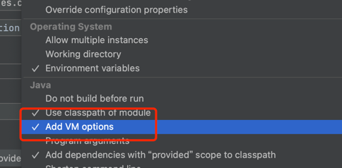

# 帮助信息

## 本地启动
  https://info.bilibili.co/display/documentation/pleiades+discovery?from_wecom=1
  参考在启动类加上环境变量:
  -Ddeploy_env=uat -Dzone=sh001 -Ddiscovery_zone=sh001 -Dpleiades.config.enabled=false -Dpleiades.paladin.enabled=false -Dapp_id=datacenter.alter.bmr-transfer-service
  然后启动主类#TransferServiceApplication
  
## 构建打包
  mvn clean package -Pdist -f pom.xml -Dmaven.test.skip=true [-U]

## 首次本地启动绑定下本地host
比如：
127.0.0.1  dev-transfer.bilibili.co

启动服务打开swagger-ui
http://dev-transfer.bilibili.co:8081/bmr/data/integration/swagger-ui.html
即可看到api列表

